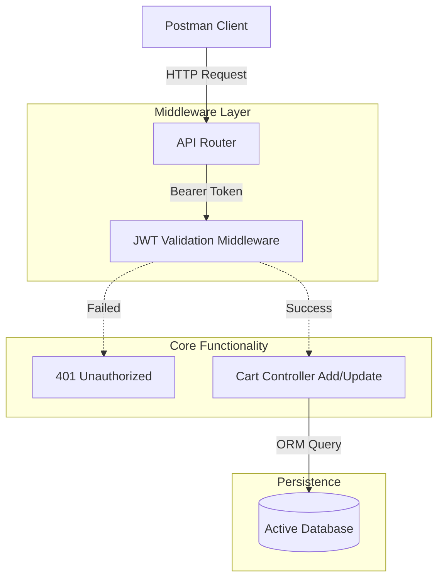

# 🛒 Secure Cart & JWT Authentication API

[](https://laravel.com)
[](https://www.php.net/)
[](https://jwt.io/)
[](https://www.postman.com/)

A streamlined Backend API originally developed for a face-to-face technical demonstration. This project implements secure stateless user sessions via JSON Web Tokens (JWT) and a fully functional "Add to Cart" logic engine, functioning entirely decoupled from a UI layer.

---

## 🏗️ System Architecture

Our solution ensures secure endpoints through robust middleware layers before cart modification happens:



---

## ✨ Key Features

### 🔐 Secure Identity Verification
*   **Decoupled Auth**: Full token-based Authentication using JWT (JSON Web Tokens), avoiding reliance on session states.
*   **Route Protection**: API endpoints are strictly guarded by JWT verification middleware preventing unauthorized access.
*   **Token Refresh**: Endpoints built for managing the full lifecycle of the authentication token.

### 🛍️ Cart Management Engine
*   **Atomic Interactions**: An optimized endpoint dedicated entirely to adding dynamic products into a user's persistent cart state.
*   **Payload Validation**: Strict request JSON validation ensuring data integrity before processing database commits.

---

## 🛠️ Application Ecosystem

| Component | Responsibility | Primary Tech |
| :--- | :--- | :--- |
| **Authentication** | Guarding all backend logic with tokens | Tymon JWT Auth |
| **Business Engine** | Managing shopping basket logic | Laravel Controller |
| **Database** | Lightweight relational state mapping | MySQL / SQLite |
| **Routing** | Handling RESTful requests and responses | API Routes |
| **Assessment** | Functionality Verification Layer | Postman Collections |

---

## 🚀 Getting Started

### 1. Prerequisites
Ensure you have the exact backend tools to test the endpoints:
*   **PHP 8.1+** & **Composer**
*   **Postman** (For making visual API requests)

### 2. Clone the Repository
Clone the repository to an isolated folder:
```bash
git clone https://github.com/vipultikhe234/Secure-Cart-And-JWT-Authentication-API.git
cd Secure-Cart-And-JWT-Authentication-API
```

### 3. Install Dependencies
Run composer to pull the framework and the JWT libraries:
```bash
composer install
```

### 4. Environment Configuration
Create the `.env` settings for DB connections:
```bash
cp .env.example .env
php artisan key:generate
```

### 5. Generate Database State
Create the necessary user and cart tables:
```bash
php artisan migrate
```

### 6. Launch Server
Host the application locally:
```bash
php artisan serve
```

---

## 🛡️ License
Distributed under the MIT License. See `LICENSE` for more information.

---

Developed with ❤️ by **[Vipul Tikhe](https://github.com/vipultikhe234)**
